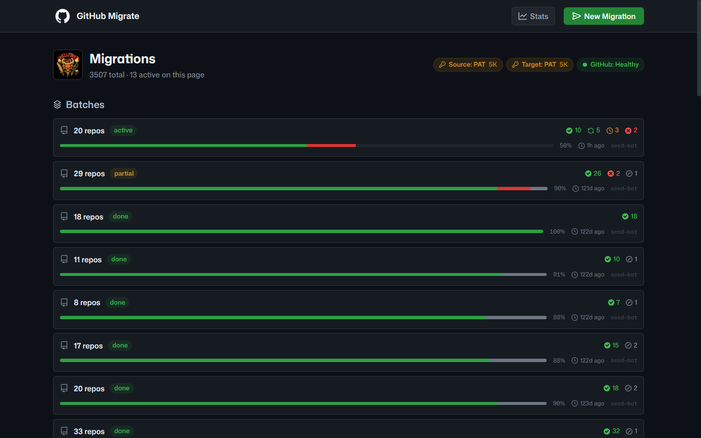
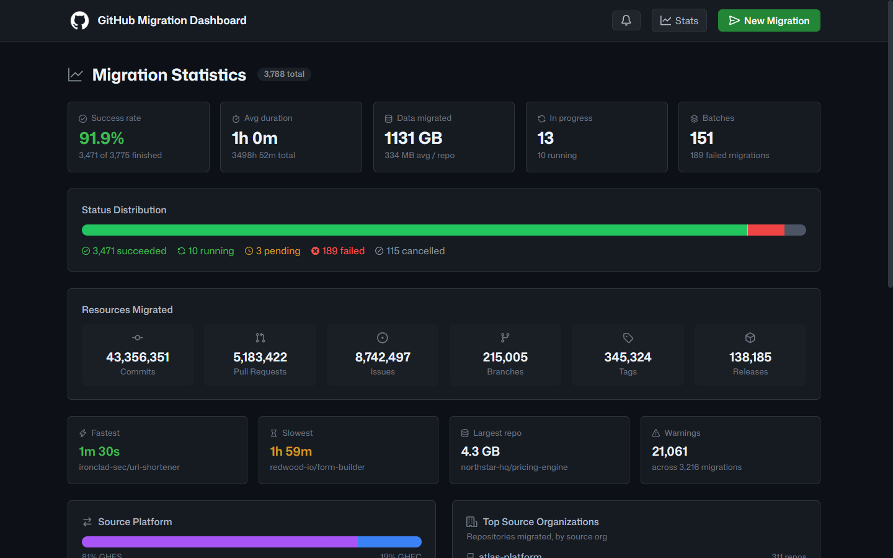
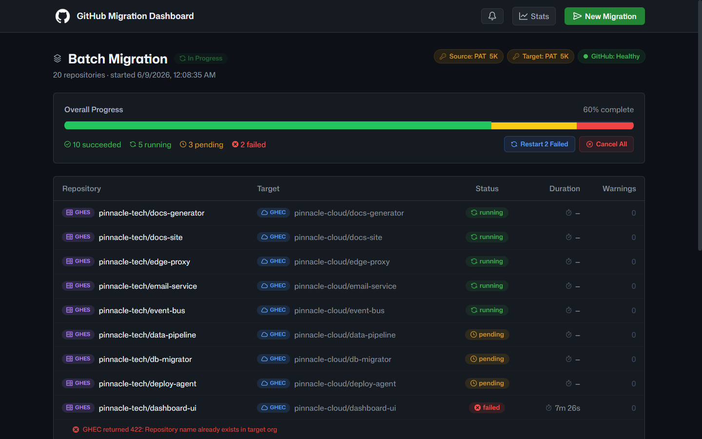
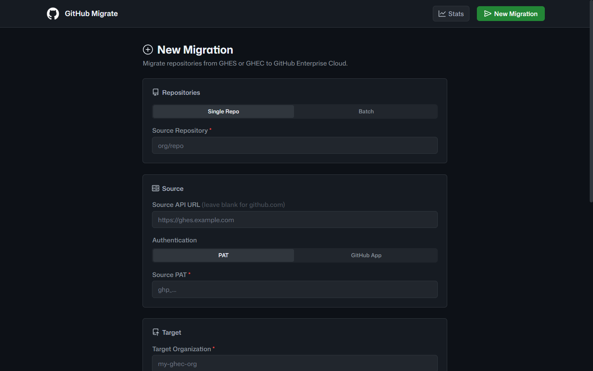
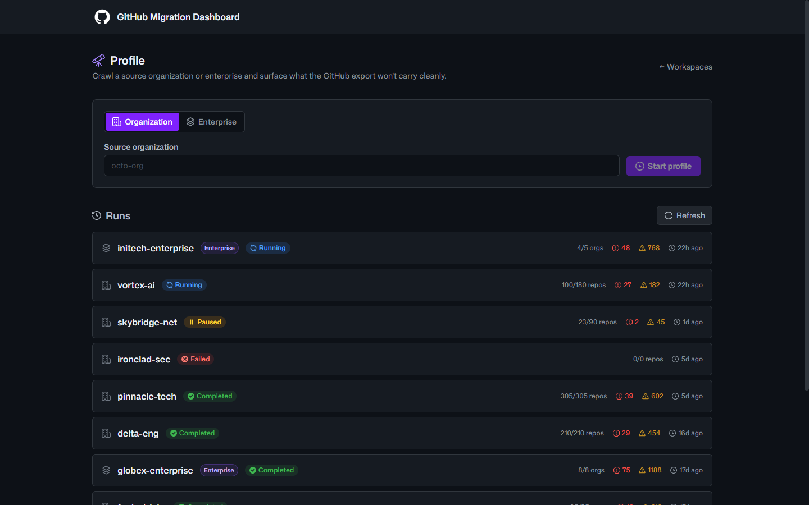
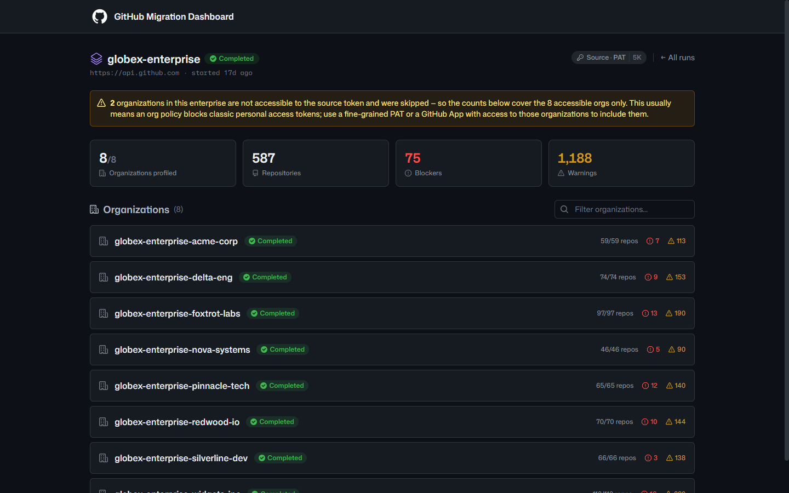

<h1>
  &nbsp;&nbsp;GitHub Migration Workbench
</h1>

<p>Profile, migrate, and track GitHub repository migrations.</p>

<p>
  
  
  
  
  
  
</p>

---

## Overview

GitHub Migration Workbench moves repositories into GitHub Enterprise Cloud, from
GitHub Enterprise Server or another Cloud org, one at a time or in batches of up
to 500, running 10 concurrently behind a FIFO queue. Before migrating, it can
profile a whole organization or enterprise to surface the per-repo considerations
an export won't carry over; during a run it streams live progress, with cancel,
restart, and crash recovery built in. Authentication is via PAT or GitHub App,
supplied per request or from the environment.

---

## Quick start

```bash
cp .env.example .env         # configure env vars (all optional)
docker compose up -d         # app at http://localhost:3000
```

Then open the app, click **New Migration**, and go. Full walkthrough in
[Getting Started](docs/getting-started.md).

---

## Documentation

| Guide | For | What's inside |
|---|---|---|
| [Getting Started](docs/getting-started.md) | Users | Install, run, and migrate your first repo |
| [Configuration](docs/configuration.md) | Operators | Every env var: auth, watchdog, target cleanup, defaults |
| [Architecture](docs/architecture.md) | Developers | Pipeline, queue, SSE, auth modes, GHES/GHEC model, DB schema |
| [API Reference](docs/api.md) | Integrators | REST + SSE endpoints and request shapes |
| [Development](docs/development.md) | Contributors | Dev loop, the gate suite, testing, discovery tooling |
| [Deployment](docs/deployment.md) | Operators | Docker, reverse proxy, `ORIGIN`, volumes, backups |
| [Troubleshooting](docs/troubleshooting.md) | Everyone | Common issues and fixes |
| [Contributing](CONTRIBUTING.md) | Contributors | Workflow, conventions, the verify contract |

---

## At a glance

- **Stack:** [Bun](https://bun.sh) · SvelteKit 2 + Svelte 5 (runes) · TypeScript · `bun:sqlite` · Tailwind v4 · [Biome](https://biomejs.dev)
- **Requirements:** Bun ≥ 1.3.9, Docker/Podman for containerized deployment
- **Quality gates:** `bun run verify` runs typecheck, svelte-check, lint, format, coverage, duplication, dead-code, circular-import, import-boundary, build, and audit — see [Development](docs/development.md)

```bash
bun install                  # install deps
bun run dev                  # dev server → http://localhost:5173
bun test                     # unit suite
bun run verify               # full gate suite (CI go/no-go)
```

A ready-to-edit [docker-compose.yml](docker-compose.yml) and
[.env.example](.env.example) cover deployment and configuration.

---

## Screenshots

<table>
  <tr>
    <td align="center" width="50%">
      <br />
      <strong>Dashboard</strong> — active &amp; completed migrations, batches
    </td>
    <td align="center" width="50%">
      <br />
      <strong>Statistics</strong> — success rate, throughput, platform breakdown
    </td>
  </tr>
  <tr>
    <td align="center" width="50%">
      <br />
      <strong>Batch detail</strong> — per-repo progress &amp; controls
    </td>
    <td align="center" width="50%">
      <br />
      <strong>New migration</strong> — single &amp; batch request form
    </td>
  </tr>
  <tr>
    <td align="center" width="50%">
      <br />
      <strong>Profile</strong> — org &amp; enterprise readiness runs
    </td>
    <td align="center" width="50%">
      <br />
      <strong>Enterprise profile</strong> — per-org rollup &amp; inaccessible-org warnings
    </td>
  </tr>
</table>
