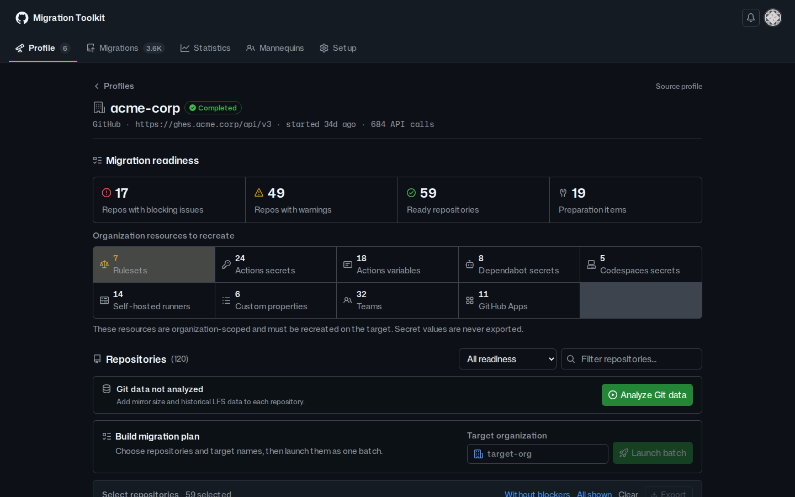
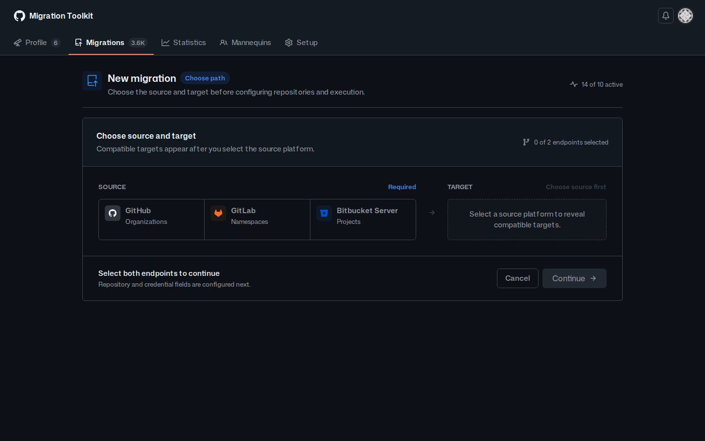
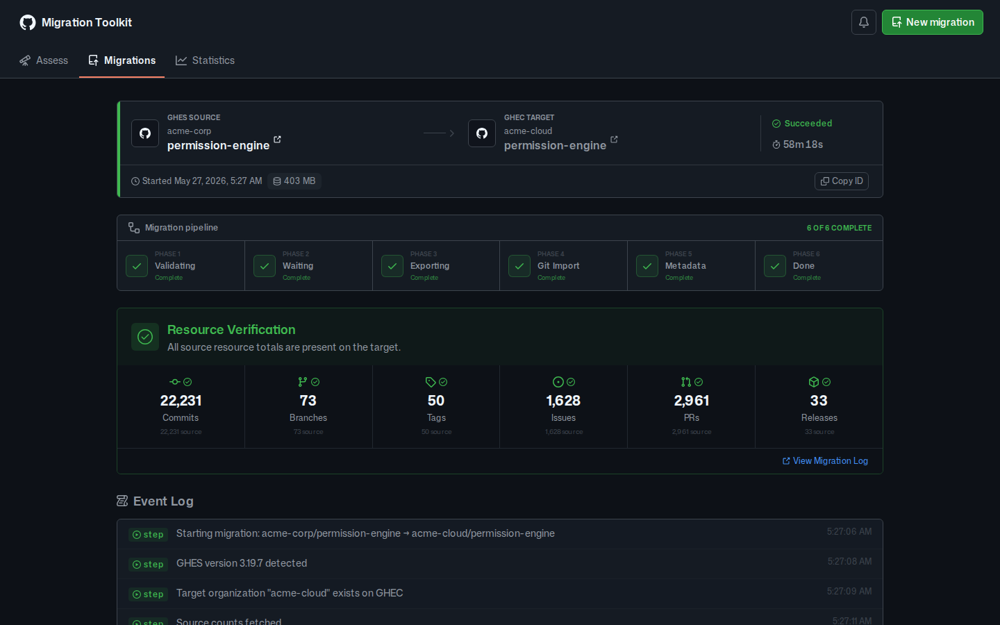

<p align="center">
	
</p>
<h1 align="center">GitHub Migration Dashboard</h1>

<p align="center">
	<strong>Profile, plan, and migrate repositories from GitHub, GitLab, or Bitbucket Server to GitHub targets.</strong>
</p>

The dashboard combines provider-aware source profiling, guided single and
batch setup, durable migration execution, live SSE progress, cancellation,
restart, reconciliation, crash recovery, and operational statistics.

## Capabilities

- Profile GitHub organizations, GitLab namespaces, and Bitbucket projects.
- Build migration plans from readiness findings and repository mappings.
- Migrate to GHEC or a configured GHES target where the provider path supports it.
- Queue up to 500 batch members under an app-wide concurrency limit of ten.
- Resume work from durable provider, GitHub, and GHES import checkpoints.
- Authenticate GitHub with PATs or Apps while keeping provider and GHES secrets server-only.
- Run as one non-root container with SQLite WAL persistence and readiness probes.

## Quick Start

```bash
cp .env.example .env
docker compose up -d --build --wait
```

The template enables unauthenticated access for a trusted local network. Before
exposing the service, configure first-administrator bootstrap credentials. The
dashboard stores Argon2id password hashes and revocable sessions in SQLite.
Open `http://localhost:3000` and choose **Profile** or **New migration**.

For source development:

```bash
bun install
bun run dev
bun test
bun run verify
```

## Screenshots

| Profile | Migration operations |
|---|---|
|  |  |
|  |  |

## Documentation

| Guide | Audience |
|---|---|
| [Getting Started](docs/getting-started.md) | First-time operators and task-oriented paths |
| [Configuration](docs/configuration.md) | Deployment owners |
| [Deployment](docs/deployment.md) | Container and proxy operators |
| [Architecture](docs/architecture.md) | Developers and reviewers |
| [API Reference](docs/api.md) | Integrators |
| [Provider Contracts](docs/provider-contracts.md) | Provider maintainers |
| [Development](docs/development.md) | Contributors |
| [Troubleshooting](docs/troubleshooting.md) | Operators and developers |
| [Contributing](CONTRIBUTING.md) | Contributors |
